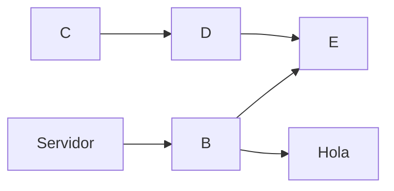

+++
title = 'Basico'
date = 2024-10-04T14:02:42+02:00
draft = false
+++
## Títulos

Para establercer los títulos usaré la siguiente

```
# título1
## título2
### título3
#### título4
##### título5
###### título6
```
Y se verá

# título1
## título2
### título3
#### título4
##### título5
###### título6

----
### Negrita y formato
Para ver el texto en negrita escribo
```
***Texto en negrita***
```
Y se verí a así

***Texto en negrita***
### Ver un video


php es un lenguaje interesante y bonito accede a la web

